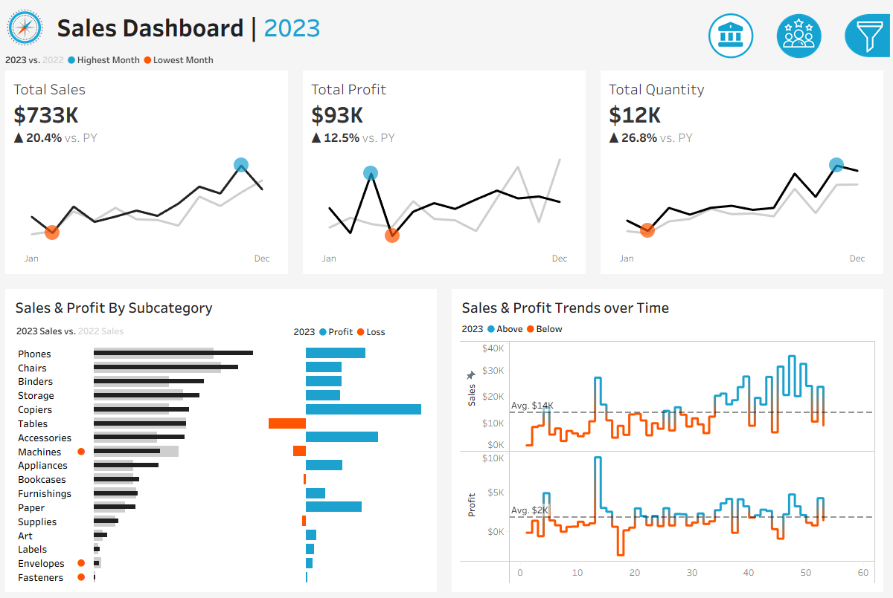
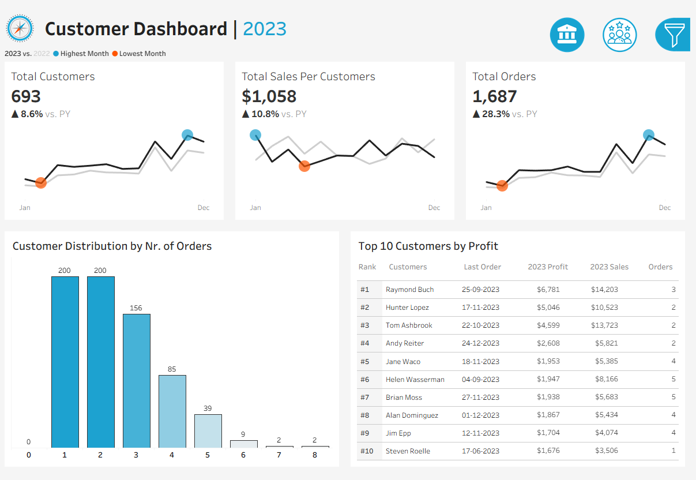
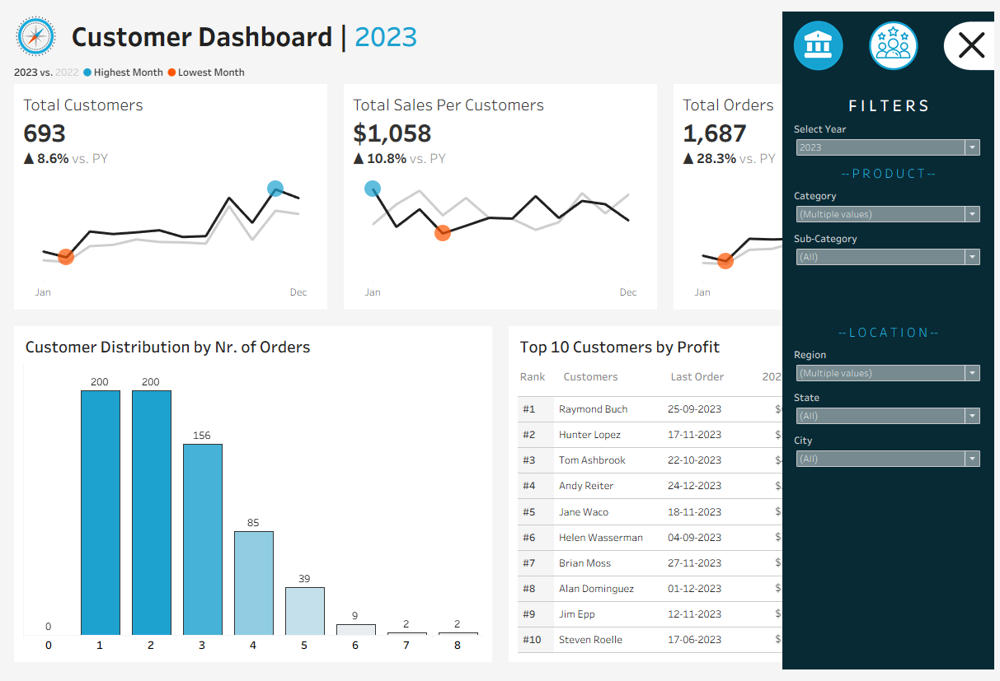

# Sales & Customer Performance Dashboard — Tableau

An interactive Tableau dashboard suite analyzing sales, profit, and customer behavior for 2023, with year-over-year comparisons against 2022. Built on a relational retail dataset (Orders, Customers, Products, Location).

🔗 **Live Interactive Dashboard:** [View on Tableau Public](https://public.tableau.com/app/profile/hardik.rawat7391/viz/Book1_17871380555460/SalesDashboard)

---

##  Overview

This project explores retail sales and customer performance through two connected dashboards — a **Sales Dashboard** and a **Customer Dashboard** — both filterable by year, product category/sub-category, and location (region, state, city).

### Sales Dashboard


**2023 Snapshot:**
| Metric | Value | YoY Change |
|---|---|---|
| Total Sales | $733K | ▲ 20.4% |
| Total Profit | $93K | ▲ 12.5% |
| Total Quantity | 12K | ▲ 26.8% |

**Includes:**
- Monthly sales/profit/quantity trend lines (2023 vs. 2022) with highest/lowest month markers
- Sales & profit breakdown by product sub-category, highlighting loss-making categories (e.g., Machines, Envelopes, Fasteners)
- Sales & profit trend chart over time, flagging periods above/below average

### Customer Dashboard


**2023 Snapshot:**
| Metric | Value | YoY Change |
|---|---|---|
| Total Customers | 693 | ▲ 8.6% |
| Total Sales per Customer | $1,058 | ▲ 10.8% |
| Total Orders | 1,687 | ▲ 28.3% |

**Includes:**
- Customer distribution by number of orders placed
- Top 10 customers ranked by 2023 profit, with sales and order counts

### Interactive Filter Panel


Both dashboards share a filter panel allowing analysis by:
- **Year**
- **Product** — Category, Sub-Category
- **Location** — Region, State, City

---

## 🛠️ Tools & Techniques
- **Tableau Public / Tableau Desktop** for dashboard design and interactivity
- Relational joins across 4 source tables: `Orders`, `Customers`, `Products`, `Location`
- Table calculations (e.g., `WINDOW_MAX` / `WINDOW_MIN`) to highlight peak and low-performing months
- Dynamic, linked filters across both dashboards for cross-dimensional exploration

##  Data Sources
| File | Description |
|---|---|
| `Orders.csv` | Transaction-level order data — sales, profit, quantity, discount |
| `Customers.csv` | Customer ID and name mapping |
| `Products.csv` | Product catalog with category/sub-category |
| `Location.csv` | Postal code to city/state/region mapping |

##  Repository Structure
```
sales-performance-dashboard-tableau/
├── README.md
├── images/
│   ├── sales_dashboard.png
│   ├── customer_dashboard.png
│   └── customer_dashboard_filters.png
├── dashboard/
│   └── Book1.twb
└── data/
    ├── Orders.csv
    ├── Customers.csv
    ├── Products.csv
    └── Location.csv
```

##  How to Explore
1. **Interact live:** Open the [Tableau Public link](https://public.tableau.com/app/profile/hardik.rawat7391/viz/Book1_17871380555460/SalesDashboard) — no installation needed.
2. **Explore in Tableau Desktop:** Download `dashboard/Book1.twb` **along with** the `data/` folder, keeping the same relative structure, then open the `.twb` file in [Tableau Desktop](https://www.tableau.com/products/desktop) or [Tableau Public](https://public.tableau.com/en-us/s/download) (both free). The workbook connects to the CSVs in `data/`, so both folders need to be downloaded together for it to open correctly.

---

##  Author

**Hardik Rawat**
B.Tech, Computer Science & Engineering (Data Science) — Manipal Institute of Technology, Bengaluru

[](https://www.linkedin.com/in/hardikrawat0309/)
[](https://github.com/Hardik-Rawat)
